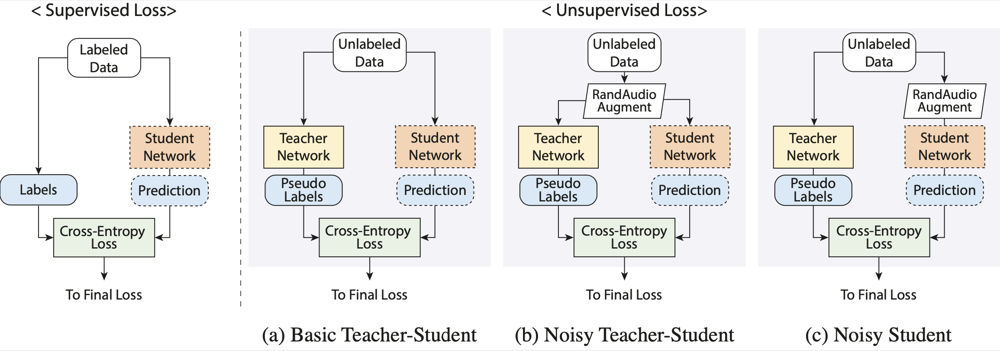

# Semi-supervised learning using teacher-student models for vocal melody extraction
The source code of *"Semi-supervised learning using teacher-student models for vocal melody extraction"*, ISMIR(2020) |<a href = "https://arxiv.org/abs/2008.06358" target="_blank">PDF</a>|

## Abstract

The lack of labeled data is a major obstacle in many music information retrieval tasks such as melody extraction, where labeling is extremely laborious or costly. Semi-supervised learning (SSL) provides a solution to alleviate the issue by leveraging a large amount of unlabeled data.<br>
In this paper, we propose an SSL method using teacher-student models for vocal melody extraction. The teacher model is pre-trained with labeled data and guides the student model to make identical predictions given unlabeled input in a self-training setting.<br>
We examine three setups of teacher-student models with different data augmentation schemes and loss functions. Also, considering the scarcity of labeled data in the test phase, we artificially generate large-scale testing data with pitch labels from unlabeled data using an analysis-synthesis method.<br>
The results show that the SSL method significantly increases the performance against supervised learning only and the improvement depends on the teacher-student models, the size of unlabeled data, the number of self-training iterations, and other training details.
We also find that it is essential to ensure that the unlabeled audio has vocal parts. Finally, we show that the proposed SSL method enables a baseline convolutional recurrent neural network model to achieve performance comparable to state-of-the-arts.



## Dependencies

- OS: LINUX 

- Programming language: Python 3.7+

- Python Library 
  - Keras 2.3.0 (Deep Learning library)
  - Librosa 0.7.0 (for STFT)  
  - madmom 0.16.1 (for loading audio and resampling)
  - Numpy, SciPy
  - pysndfx 0.3.6 (for randAudioAugment)

-  Hardware
  -  1 GPU : GeForce GTX 1080ti
  
    
## Using melody_extraction_SSL from the command line

``` 
$ python melodyExtraction_NS.py -p ./audio.test_audio.mp4 
$ python melodyExtraction_NS.py -p ./audio/test_audio_file.mp4 -o ./results/ -gpu 0 

[optional arguments]
  -p filepath             Path to input audio(.wav) (default: ./test_audio_file.mp4)
  -gpu gpu_index          Assign a gpu index for processing.
                          It will run with cpu if None. (default: None)
  -o output_dir           Path to output folder (default: ./results/)
```


- The resulting 'pitch_(*file_name*).txt' contains 2 columns: 
  - the first : timestamps (10 ms)
  - the second : the predicted fundamental frequency in Hz

```
0.08 0.0000
0.09 0.0000
0.10 0.0000
0.11 0.0000
0.12 182.3449
0.13 182.3449
0.14 183.6663
0.15 185.6663
0.16 187.0117
0.17 188.3669
```
